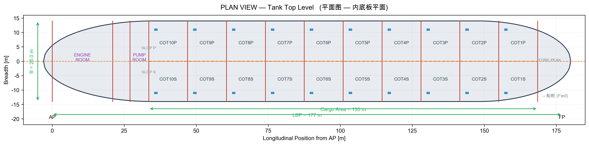
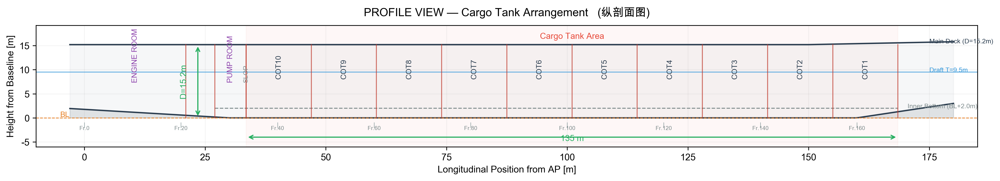
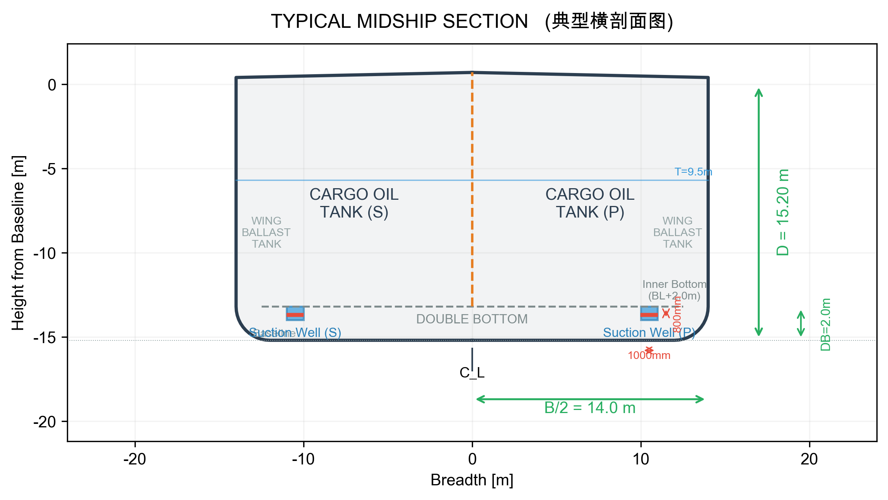
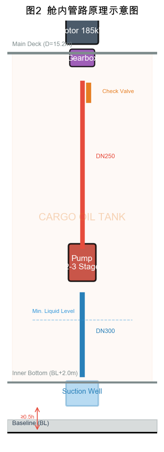
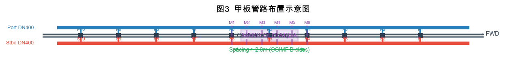

# 33000DWT双燃料成品油轮货油泵系统设计

**作者：XXX**

**（XX大学 船舶与海洋工程学院，江苏 南京 210000）**

---

## 摘要

本文以一艘33000DWT双燃料成品油轮为研究对象，对其货油泵系统进行了完整设计。该船设20个货油舱（10对）和2个污油舱，配备22套独立深井离心泵系统，总装卸能力2400 m³/h，可同时装卸6种油品。依据CCS规范、MARPOL附则I、OCIMF建议案及FSS Code，完成了管材等级确定、泵水力计算、气蚀验算及泵型号选择等设计工作。计算结果表明：单泵流量400 m³/h，扬程120 mlc，配套185 kW防爆电动机，最不利工况（汽油）下NPSHa达6.66 m，满足安全要求。本文同时完成了货仓布置、吸油井、管路、惰气吹扫及透气系统的方案设计，方案全面满足适用规范要求。

**关键词：** 成品油船；货油系统；离心泵；惰气系统；管路设计

---

## 0. 前言

随着全球成品油贸易的持续增长，成品油轮作为区域性油品运输的主力船型，其货油装卸系统的设计直接关系到船舶的运营效率和安全性能。本文所设计的船舶为一艘33000DWT双燃料成品油轮，总长约180 m，型宽28 m，型深15.2 m，设计吃水9.5 m，主要航行于近海及国际航线，装载汽油、柴油、航空煤油等多种成品油。

本船货油系统设计的核心任务是确定一套安全、高效、满足国际公约和船级社规范的货油装卸方案。设计依据包括CCS《钢质海船入级规范》、MARPOL 73/78附则I、SOLAS公约、FSS Code（国际消防安全系统规则）以及OCIMF（石油公司国际海事论坛）相关建议案。设计过程遵循"规范先行—水力计算—设备选型—系统集成"的技术路线，力求方案在满足规范要求的前提下兼顾经济性和可维护性。

本船采用每舱独立泵系统的设计方案，共计22套立式深井离心泵，可在同一港口同时装卸6种不同种类的成品油，大幅提高了运营灵活性。

---

## 1. 货仓结构

### 1.1 货舱总体布置

本船货舱区位于机舱前壁（约Fr.30）至艏尖舱后壁之间，总长约135 m，占垂线间长的76%。货舱区采用双壳结构，满足MARPOL附则I第19条关于5000DWT以上油船须设双层底和双舷侧的保护位置要求。经核算，本船双层底高度取2.0 m（≥B/15=1.87 m），边舱宽度取2.0 m（满足最小值要求），均符合规范。

货舱区共设20个货油舱，以中纵舱壁为界左右对称布置，编号为COT 1P/1S至COT 10P/10S（自艏向艉编号），每对货油舱纵向长度约13.5 m。此外，货舱区尾部设2个污油舱（SLOP P/S），用于收集洗舱水和含油残余物，总容积按货油总量的0.8%设计，约260 m³；污油舱后方设泵舱，布置货油泵的驱动电机和齿轮箱、管路阀组等设备。

舱室划分满足本船可同时装卸6种油品的设计要求。通过独立的中纵舱壁和各横舱壁将不同油品完全隔离，利用甲板管路上的阀门切换实现不同油品经各自集管接头装卸。

### 1.2 货舱结构图

货仓结构布置包含平面图（内底板平面）、纵剖面图和典型横剖面图三视图。各视图如下：



**图1(a) 货仓结构平面图（内底板平面）**



**图1(b) 货仓结构纵剖面图**



**图1(c) 典型货舱横剖面图**

---

## 2. 管材选用

### 2.1 管材等级

根据CCS《钢质海船入级规范》第3篇第2章2.1.2条，货油管系属于Ⅲ级管系，设计压力取1.0 MPa，设计温度范围-20°C至+120°C。所有货油管路的设计、制造和试验均须满足Ⅲ级管系的要求。

### 2.2 管材类型与适用范围

本船货油管路管材选用原则如下：

（1）**舱内及甲板小通径管路（DN≤400 mm）**：选用GB/T 8163-2018标准的20#优质碳素钢无缝钢管，具有成熟的焊接性能和足够的机械强度。

（2）**甲板大通径总管（DN>400 mm）**：集管区汇总总管DN600可选用直缝埋弧焊钢管（SAW），焊缝系数e=0.90，满足CCS规范对DN≤500 mm焊接钢管的直接使用条件；DN600需经CCS特别批准，等效设计。

（3）**特殊管段**：集管区通岸接头短管和经常拆卸的管段采用不锈钢（304L或316L），以提高耐蚀性和减少维护。

本船舱内及甲板管路阀门选型遵循以下原则：大口径总管（DN400及以上）选用蝶阀，具有结构紧凑、重量轻、操作力矩小的优点；小口径支管（DN250及以下）选用球阀或闸阀，球阀密封性优良，适用于经常操作的管路；截止阀用于惰气隔离和节流调节场合；止回阀设于泵出口和惰气总管连接处，防止介质倒流。所有阀门均须满足CCS规范对Ⅲ级管系附件的要求，阀体材质不低于管材等级。

管件（弯头、三通、异径管等）材质与主管一致，弯管工艺要求冷弯半径R≥3D、热弯R≥2D，弯后须进行消除应力热处理。

### 2.3 管壁厚度

管壁厚度按CCS规范第3篇第2章2.2.3条公式计算：

$$t_{min} = \frac{P \cdot D}{2[\sigma] \cdot e} + c$$

取设计压力P=1.0 MPa，许用应力[σ]=78 N/mm²（20#钢），腐蚀余量c=1.5 mm。经核算，本船各管段最小壁厚均可满足规范要求。各DN对应的壁厚选取如下（均不低于CCS规范推荐最小壁厚）：DN250采用Sch40标准（外径273.0 mm×壁厚9.3 mm），DN300采用Sch40标准（外径323.9 mm×壁厚9.5 mm），DN400采用Sch40标准（外径406.4 mm×壁厚10.0 mm），DN600采用Sch30标准（外径609.6 mm×壁厚12.5 mm）。

### 2.4 涂层与防腐蚀

货油管路内壁涂覆纯环氧树脂漆，干膜厚度≥250 μm（符合NACE SP-01-88标准）；外壁采用环氧富锌底漆（≥50 μm）+环氧云铁中间漆（≥100 μm）+聚氨酯面漆（≥50 μm）的三层涂装体系，总干膜厚度≥200 μm。货油舱内管路涂层体系须与货油舱涂层兼容，确保耐油、耐化学介质性能。

### 2.5 静电接地

所有货油管路法兰接头间须装设铜编织带跨接（截面积≥16 mm²），跨接电阻<0.01 Ω；管路每隔约20 m设置一处船体接地连接点，任意位置对船体接地电阻<1 MΩ，确保静电安全，满足IEC 60092-401标准。

---

## 3. 货油泵系统设计

### 3.1 泵的选型原则

货油泵是成品油轮最核心的甲板机械之一，其选型直接决定船舶的装卸能力和运营经济性。根据《船舶设计实用手册（第3版）——轮机分册》[1]和《离心泵应用技术》[2]的推荐，成品油轮货油泵的选型应遵循以下原则：

（1）**独立分舱原则**：为满足同时装卸多种油品的要求，每个货油舱须设一套独立的泵系统，各舱管路完全分隔，避免油品混合。

（2）**NPSH优先原则**：货油泵叶轮应尽可能浸没在液下，以获得最大的装置气蚀余量（NPSHa），防止气蚀损坏。这是选用立式深井离心泵而非卧式机舱泵的核心原因。

（3）**防爆安全原则**：所有驱动电机必须为防爆型（Ex d IIB T4及以上），电气设备须满足IEC 60079标准对Zone 1危险区域的要求。

（4）**检修便利原则**：泵和驱动装置应布置在便于检修的位置，深井泵的叶轮和轴系可从甲板面整体吊出，无需人员进入货油舱。

（5）**高效节能原则**：泵的额定工况应位于其性能曲线的高效区（η≥75%），同时满足整个装卸过程中流量—扬程的变化范围。

### 3.2 流量计算

#### 3.2.1 单泵流量

根据任务书要求，每套泵系统的设计流量为：

$$Q = 400 \text{ m³/h}$$

换算为国际单位制：

$$Q = \frac{400}{3600} = 0.1111 \text{ m³/s}$$

#### 3.2.2 总装卸流量

本船可同时使用6套泵系统进行装卸作业（对应6种不同油品）：

$$Q_{total} = 6 \times 400 = 2400 \text{ m³/h} = 0.6667 \text{ m³/s}$$

#### 3.2.3 装卸时间估算

单舱有效容积约1500 m³（20个货油舱均分总货油容积，扣除结构构件体积），单舱卸油时间约3.75小时。全船20个货油舱分4批轮换卸油，总卸油时间约12.5小时，满足常规港口12~16小时的作业窗口要求。

### 3.3 扬程计算

#### 3.3.1 扬程构成

货油泵总扬程H按下式计算[1]：

$$H = H_{st} + H_{loss} + H_v$$

其中：H_st为静扬程（含几何提升高度和码头输送背压），H_loss为管路总水头损失（沿程+局部），H_v为出口速度头，单位均为mlc（米液柱）。

#### 3.3.2 几何提升高度

泵叶轮位于吸油井底部，距基线约0.8 m。集管区法兰中心位于主甲板上方约0.8 m。扫舱末期液面距吸油井底约0.5 m，最不利工况下的几何提升高度为：

$$H_{geo} = (15.20 + 0.8) - (0.8 + 0.5) = 14.7 \approx 15.0 \text{ m}$$

#### 3.3.3 码头输送背压

成品油码头通常要求集管出口输送压力≥0.8 MPa，以保证油品经岸上管路进入储罐[1]。换算为液柱高度（设计密度ρ=850 kg/m³）：

$$H_{delivery} = \frac{0.8 \times 10^6}{850 \times 9.81} = 95.9 \approx 96.0 \text{ mlc}$$

$$H_{st} = 15.0 + 96.0 = 111.0 \text{ mlc}$$

#### 3.3.4 管路水头损失

采用Darcy-Weisbach公式逐段计算[4]，局部阻力按当量长度法处理[1]。经详细计算，吸入管段（DN300，含钟形吸入口、弯头、闸阀）损失0.14 mlc，排出管段（DN250，含立管、水平管、阀组共计当量长度156.5 m）损失2.83 mlc，合计：

$$H_{loss} = 0.14 + 2.83 = 2.97 \approx 3.0 \text{ mlc}$$

#### 3.3.5 出口速度头

$$H_v = \frac{v^2}{2g} = \frac{2.18^2}{2 \times 9.81} = 0.24 \text{ mlc}$$

出口速度头数值很小（占总扬程的0.2%），实际设计中可将其计入管路损失余量，不再单独列出[1]。此处保留计算过程供参考。

#### 3.3.6 总扬程

$$H = 111.0 + 3.0 + 0.24 = 114.2 \text{ mlc}$$

取5%设计余量，设计扬程定为：

$$H_{design} = 114.2 \times 1.05 = 119.9 \approx \textbf{120 mlc}$$

该值在油轮货油泵80~130 mlc的典型范围内，折算为压力约1.0 MPa，与设计压力吻合良好。

### 3.4 功率计算

#### 3.4.1 水力功率

$$P_{hyd} = \rho \cdot g \cdot Q \cdot H = 850 \times 9.81 \times 0.1111 \times 120 = 111.2 \text{ kW}$$

#### 3.4.2 轴功率

深井离心泵在设计工况点的效率取η_pump=0.78（比转速80~120区间推荐值[2]）：

$$P_{shaft} = \frac{P_{hyd}}{\eta_{pump}} = \frac{111.2}{0.78} = 142.6 \text{ kW}$$

#### 3.4.3 配套电机功率

传动方式采用防爆电动机经直角齿轮箱驱动。齿轮箱传动效率η_mech=0.96，储备系数k=1.15（轴功率100~200 kW区间推荐值[1]）：

$$P_{motor} = \frac{P_{shaft}}{\eta_{mech}} \times 1.15 = \frac{142.6}{0.96} \times 1.15 = 170.8 \text{ kW}$$

圆整至标准电机功率级：**P_motor=185 kW**。

#### 3.4.4 全船装机功率

| 项目 | 数值 | 单位 |
|------|:---:|------|
| 单台电机功率 | 185 | kW |
| 总装机功率（22台） | 4,070 | kW |
| 同时工作最大功率（6台） | 1,110 | kW |

### 3.5 气蚀验算

#### 3.5.1 装置气蚀余量

装置气蚀余量按下式计算[2]：

$$NPSH_a = \frac{P_{atm} - P_v}{\rho \cdot g} + z_s - h_{f,s}$$

最不利工况为泵送高蒸气压的汽油（ρ=750 kg/m³, P_v=55 kPa @40°C）。泵叶轮最低淹没深度z_s=+0.50 m，吸入管路损失h_f,s=0.14 mlc：

$$NPSH_a = \frac{101325 - 55000}{750 \times 9.81} + 0.50 - 0.14 = 6.30 + 0.50 - 0.14 = 6.66 \text{ m}$$

常规柴油工况（ρ=850 kg/m³, P_v=2 kPa）：NPSHa=12.27 m，余量更为充裕。

#### 3.5.2 安全校核

深井离心泵在Q=400 m³/h、H=120 mlc工况下的必需气蚀余量NPSHr典型值为3.5~5.0 m，保守取NPSHr=4.5 m。按CCS规范要求，须满足NPSHa≥NPSHr+0.5 m：

| 工况 | NPSHa (m) | NPSHr+0.5 (m) | 余量 (m) | 判定 |
|------|:---:|:---:|:---:|:---:|
| 汽油（最不利） | 6.66 | 5.0 | 1.66 | ✅ 通过 |
| 柴油（常规） | 12.27 | 5.0 | 7.27 | ✅ 充裕 |

汽油工况余量1.66 m>0.5 m，气蚀验算合格。为确保扫舱末期安全运行，建议设置低液位联锁保护（液位低于叶轮中心线以上0.3 m时自动停泵）。

### 3.6 泵型号确定

经综合比选，推荐选用**立式深井离心泵（Vertical Deepwell Centrifugal Pump）**，型号VCP400-120系列，2~3级叶轮。主要技术参数汇总于表1。

**表1 单套货油泵系统主要参数汇总**

| 序号 | 参数 | 符号 | 设计值 | 单位 |
|:---:|------|------|:---:|------|
| 1 | 设计流量 | Q | 400 | m³/h |
| 2 | 设计扬程 | H | 120 | mlc |
| 3 | 泵效率 | η | ≥78% | — |
| 4 | 轴功率 | P_shaft | 142.6 | kW |
| 5 | 电机功率 | P_motor | 185 | kW |
| 6 | 电机转速 | n | 1,480 | rpm |
| 7 | NPSHr | — | ≤4.5 | m |
| 8 | 泵级数 | — | 2~3 | 级 |
| 9 | 叶轮材质 | — | 青铜/双相不锈钢 | — |
| 10 | 驱动方式 | — | 防爆电机+直角齿轮箱 | — |
| 11 | 轴封型式 | — | 双端面机械密封 | — |
| 12 | 吸入管径 | — | DN300 | mm |
| 13 | 排出管径 | — | DN250 | mm |

选择立式深井离心泵的理由：（1）叶轮浸没在货油中，NPSHa充裕，气蚀风险低；（2）无需灌泵，启动操作简便；（3）每舱独立安装，管路简洁，不会发生不同油品间的交叉污染；（4）甲板面仅占用电动机和齿轮箱的安装空间，不挤占货舱有效容积。

泵在排出阀关闭状态下启动，待转速稳定后缓慢开启排出阀。设有低液位停泵保护和惰气压力低联锁保护（惰气压力<100 mmH₂O报警，<50 mmH₂O停泵）。

---

## 4. 吸油井设计

### 4.1 吸油井位置

每舱设置一个吸油井，位于货油舱后部偏舷侧——左舷舱（COT xS系列）设在左后角、右舷舱（COT xP系列）设在右后角。吸油井后壁距横舱壁约300~500 mm，距舷侧纵舱壁约500~800 mm。该位置利用船舶正常航行时的尾倾状态，使残余货油自然流向吸油井，有利于提高扫舱效率。

### 4.2 尺寸设计

吸油井推荐尺寸为纵向长度1200~1500 mm、横向宽度800~1000 mm、深度600~800 mm（低于内底板平面）。本船取1500 mm×1000 mm×800 mm。吸油井口部开口不小于2倍吸口直径（约600 mm），保证吸口附近流场均匀。吸入口距井底≥150 mm，防止吸入底部沉积物。井口设可拆卸格栅（扁钢50×10 mm，间距80 mm）拦截大块杂物。

### 4.3 与双层底的关系

吸油井允许凸入双层底空间，但须满足MARPOL附则I第19条及IACS UR M48的要求：吸油井底部距船底板外板的距离不得小于双层底总高度的50%（即≥0.5h）。本船双层底高度h=2.0 m，吸油井底距船底板≥1.0 m，实际取1.1 m，井底距基线0.9 m。满足规范要求。

吸油井壁板厚与相邻内底板同厚或加厚2 mm，开口处做补强。焊缝须全焊透，并进行密性试验（煤油试验或真空试验）。

### 4.4 防击板

吸口正下方设钟形防击板（Bellmouth Guard），距吸口底部≥1.5D（约457 mm，D为吸口直径DN300）。防击板采用10 mm厚船用钢板，4脚支撑焊接于吸油井底板，防止涡流吸入空气和杂物进入泵体。

---

## 5. 管路布置

### 5.1 舱内管路

#### 5.1.1 舱内管路方案

本船舱内管路采用每舱独立直吸式布置，即每个货油舱设一台深井泵，泵的吸入管（DN300）直接从吸油井向上接至泵入口，泵出口经排出立管（DN250）垂直升至甲板面。此方案的优点是管路最短、无舱内水平管段、不会发生不同油品间的交叉污染，完全满足同时装卸6种油品的设计要求。

吸入管的钟形吸入口设在吸油井内，朝向船艉方向。深井泵的轴系经泵柱（Pump Column）向上延伸至甲板面，泵柱内为排出立管，泵柱外壁与舱内油品直接接触。



**图2 舱内管路原理示意图**

### 5.2 甲板管路

#### 5.2.1 甲板管路布置

甲板货油管路沿船中步桥两侧敷设。每台深井泵的排出立管上到甲板面后，经水平支管汇入单侧甲板总管（DN400，服务于同一舷侧的泵组），两侧总管再汇入集管区的汇总总管（DN600）。



**图3 甲板管路布置示意图**

#### 5.2.2 集管区布置（OCIMF要求）

本船33000DWT属于OCIMF分类的B类船舶（16000~50000 DWT）。集管区布置满足以下要求[1]：

| 项目 | 要求 | 本船设计 |
|------|------|----------|
| 纵向位置 | 船长中点±3.0 m | LBP/2=88.5 m处，满足 |
| 法兰距船壳 | 4.6 m | 4.6 m |
| 集管中心间距 | ≥2.0 m | 取2.5 m |
| 集管数量 | — | 6组（对应6种油品） |
| 法兰标准 | ANSI Class 150 | DN250/DN300 ANSI 150# |
| 变径接头 | 配DN300×DN250等 | 各2个 |
| 滴油盘 | 围板≥150 mm | 设滴油盘，接通污油舱 |

集管区配备软管吊一台（SWL≥1.5t），甲板下设加强结构，设可拆式护栏。通岸接头配盲板法兰和密封垫。

---

## 6. 惰气吹扫与透气系统

### 6.1 系统必要性

根据SOLAS公约第II-2章第4.5.5条，载重量20000吨及以上的油船必须装设固定式惰气系统（Inert Gas System, IGS）。本船33000DWT>20000DWT，须强制装设。惰气系统的核心功能是向货油舱内充注含氧量低于5%的惰性气体，使舱内气氛含氧量始终低于8%（可燃极限以下），从而防止火灾和爆炸事故。

本船选用独立惰气发生器（Inert Gas Generator, IGG）方案（因双燃料船不设燃油锅炉），惰气供气量按最大卸油速率的125%设计（即3000 m³/h），以确保卸油过程中舱内始终保持正压，防止空气倒吸入舱。

### 6.2 与货油管系的连接隔离

惰气总管与货油总管之间允许连通（用于卸油后惰气吹扫管路），但必须设置可靠的隔离装置，防止货油或货油蒸气倒流入惰气系统。根据FSS Code第15章3.1.2条，本船采用**双截止阀+中间通大气管**方案：

```
    惰气总管 → 截止阀① → 通大气支管(带截止阀③) → 截止阀② → 止回阀 → 货油总管
                            ↓
                         通大气
```

正常装卸作业时：截止阀①和②关闭，截止阀③开启通气，确保惰气与货油完全隔离。
惰气吹扫作业时：截止阀③关闭，截止阀①和②开启，惰气经货油总管进入各舱支管进行吹扫。

此外，惰气总管上设甲板水封装置，作为防止货油气体回流至机舱区域的最终屏障。

### 6.3 吹扫流程

卸油作业结束后，执行以下吹扫程序：
1. 确认各货油舱液位已降至最低
2. 关闭货油泵排出阀
3. 开启惰气发生器，确认惰气含氧量≤5%
4. 打开双截止阀隔离装置，惰气进入货油总管
5. 惰气依次吹扫各舱管路，将残油推入污油舱
6. 吹扫完毕后恢复隔离状态（关闭截止阀①②，开启截止阀③通气）

### 6.4 透气管布置

根据CCS《钢质海船入级规范》第6篇第4章，各货油舱须设独立透气管，不得共用透气装置。本船20个货油舱和2个污油舱均设独立透气管（DN150），汇总至透气总管（DN300）后引至主桅杆顶部排放。

各舱透气管上设手动隔离阀，正常运行时保持开启。当某舱需要与其他舱完全隔离时（如装载特殊油品），可关闭该舱透气管隔离阀。

### 6.5 高速透气阀（P/V阀）

透气总管上设高速P/V阀（Pressure/Vacuum Relief Valve），其功能是：
- **超压保护**：当舱内压力超过设定正压时自动开启排放，防止舱体结构受损
- **真空保护**：当舱内出现负压时自动开启吸入空气，防止舱体被压瘪
- **正常透气**：装卸作业时提供可控的油气排放通道

P/V阀主要参数设定如下：

| 参数 | 设定值 | 单位 |
|------|:---:|------|
| 正压开启 | +1,400 | mmH₂O (+13.7 kPa) |
| 负压开启 | −350 | mmH₂O (−3.4 kPa) |
| 全流量开启 | ≤正压×120% | mmH₂O |
| 排放流量 | 3,000 | m³/h (≥1.25×2400) |

P/V阀须经CCS型式认可，进口设防回火型阻火器。

### 6.6 出口位置

透气管出口距露天甲板高度≥4.0 m（设在桅杆顶部），距上层建筑进气口水平距离≥10 m，距可能点火源≥15 m。出口方向垂直向上，端头设防火网（网孔≤13 mm×13 mm），满足SOLAS II-2/4.5.3.4条要求。

透气总管最低处设泄放考克，接泄放管通至污油舱，用于排放管路中冷凝的油蒸气凝液。

---

## 7. 结论

本文对一艘33000DWT双燃料成品油轮的货油泵系统进行了完整的设计计算，主要结论如下：

（1）货舱区采用双壳结构，设20个货油舱（10对）和2个污油舱，各舱独立泵系统方案满足同时装卸6种油品的要求，符合MARPOL附则I的保护位置和防污染规定。

（2）货油管路系统选用Ⅲ级管，设计压力1.0 MPa，选用20#碳钢无缝钢管，内涂纯环氧树脂≥250 μm，管路接地电阻<1 MΩ，满足CCS规范。

（3）经水力计算，单套泵系统的设计参数为：流量Q=400 m³/h，扬程H=120 mlc，轴功率P_shaft=142.6 kW，选用185 kW防爆电动机。气蚀验算在最不利工况（汽油）下NPSHa=6.66 m>NPSHr+0.5 m=5.0 m，满足安全要求。推荐选用立式深井离心泵VCP400-120系列，2~3级。

（4）吸油井设于每舱后部舷侧，尺寸1500×1000×800 mm，凸入双层底深度满足距船底板≥0.5h的规范要求，设防击板和可拆卸格栅。

（5）管路布置采用舱内直吸式+甲板总管式，集管区布置符合OCIMF B类船标准；惰气吹扫与透气系统采用独立惰气发生器+双截止阀隔离方案，各舱独立透气管汇总至桅杆P/V阀排放，全面满足SOLAS、FSS Code和CCS规范的各项要求。

综上所述，本船货油泵系统设计方案在安全性、可靠性和运营灵活性方面均满足国际公约和船级社规范的各项要求，可为此类船型的货油系统设计提供参考。

---

## 参考文献

[1] 陈可越. 船舶设计实用手册——轮机分册[M]. 第3版. 北京：国防工业出版社，2013.

[2] 吴德明. 离心泵应用技术[M]. 北京：中国石化出版社，2013.

[3] 谢云平. 船舶设计原理[M]. 北京：国防工业出版社，2014.

[4] 孔珑. 工程流体力学（第四版）[M]. 北京：中国电力出版社，2013.

[5] 中国船级社. 钢质海船入级规范[S]. 北京：中国船级社，2023.

[6] IMO. MARPOL 73/78 Consolidated Edition, Annex I[S]. London: IMO, 2011.

[7] IMO. SOLAS Consolidated Edition, Chapter II-2[S]. London: IMO, 2020.

[8] IMO. International Code for Fire Safety Systems (FSS Code), Chapter 15[S]. London: IMO, 2015.

[9] OCIMF. Recommendations for Oil Tanker Manifolds and Associated Equipment[S]. 5th ed. London: OCIMF, 2021.

[10] IMO. International Code of Safety for Ships Using Gases or Other Low-flashpoint Fuels (IGF Code)[S]. London: IMO, 2017.

---